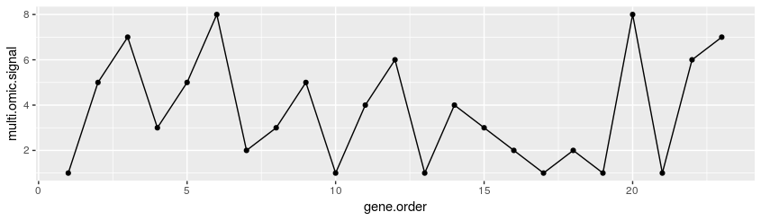

# Bacterial multi-omic oscillatory networks
### Spatial periodicty and velocity of propagation in bacterial multi-omic network dynamics
This repository contains the manuscript mentioned in the title, and associated source code for Algorithm 1 and Algorithm 2, the whole data set of signals and some functions to obtain fast results with several multi-omic combinations within and between bacteria. Should you need help running our code, please contact us.

### Periodicity/Oscillation score and Velocity of propagation (Algorithm 2)

The optimized algorithm with which the scores of periodicity and propagation velocity of the multi-omic spatial signal were calculated is written in R in [this file](SupplementaryAlgo2.R)
