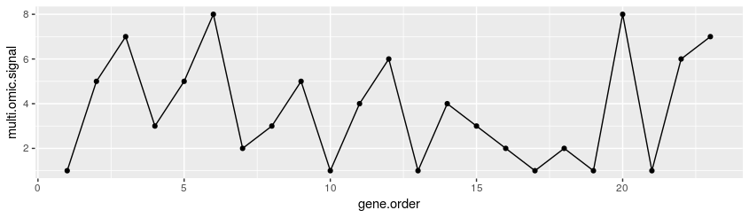

#  Understanding oscillatory dynamics in bacterial multi-omic networks
### 
This repository contains the supplementary materials of the manuscript mentioned in the title, the whole data set of signals (**RData format**) and the associated source code, written in **R**, in order to replicate our analyses and to obtain other results considering several multi-omic combinations within and between bacteria.

Should you need help running our code, please [contact us](mailto:fbardozzo@unisa.it).

**Motivation**: Biotechnology is centered on the exploiting genetic or/and protein regulatory networks towards the product of useful compounds. It is known that these networks involve more than one type of biomolecule as well as biological processes operating at multiple omic levels. This allows to combine information from single-omics into a multi-omic space. The projection of the molecular networks on this space potentially lead to the discovery of new features, revealing regularities that describe well-understood or unknown bacterial mechanisms and organism specific network dynamics. 

**Results**: Our group has previously recognized oscillations in E.\emph{coli} networks dynamics when multi-omic patterns are obtained. While, using models for signal processing and communication engineering, this work focus on the characterization of the intensity and extension of oscillations across taxa, and identify metrics that could allow biotechnology explanation. We have based our research on 11 bacteria. Thus, we have generated and analyzed thousands of multi-omic pathway-based signals integrating the gene order information, codon usage, gene expression, protein molecular weight at several functional levels. Our analyses showed that oscillations exist in bacteria. Moreover, we show interesting evidence that the oscillatory networks present common behaviours with a combined dynamic response to perturbations. Thus, we obtained a meaningful picture of the oscillatory networks dynamics and their circuital interplay per experiments. We validated these results through a multi-organism comparative analysis.

#### Step 1 - Inter-organisms amplitude consensus (IOAC) procedure 
In order to compare the signals between different organisms, an amplitude discretization process was applied. The number of levels of discretization is decided through the following procedure, that it is called: Inter Organisms Amplitude Consensus (IOAC) [source code here](ioac_procedure/Data_norm.R). The relative dependencies to the RData datasets are explicitly indicated in the source code.

#### Step 2 -  Median change point detector in order to search the periodicity windows ( Algorithm 1) 
The median change point detection algorithm for the estimation of the half periodicity search windows (theta) is calculated as described [here](SupplementaryAlgo1.R). See also the table of the [estimated thetas](table_of_thetas) applied for all the organisms and for all the multi-omic combinations. 

#### Step 3 -  Oscillation indices (Algorithm 2)
The oscillation indices (osc_s and osc_k) for multi-omic spatial signal were calculated with the script linked [here](SupplementaryAlgo2.R). In order to test the script in this source code we provide two simple toy examples.
In the next subsecton we link the whole dataset of signals also with the oscillation indices already computed. 

#### Step 4 -  Whole dataset of the multi-omic signals

Note, in order to make the algorithms described above faster and easier to use, we have provided simple examples. The same algorithms, however, have been applied to more than two million of mult-omic signals and the results obtained are collected in this dataset: [global.nt](https://thinfi.com/c30r). The password is: text us.
In addition, the dataset already contains all the associations to the functional classes of [KEGG Orthology](https://www.genome.jp/kegg-bin/get_htext?ko00001) and to the identifiers linked to the [COLOMBOS](http://colombos.net/) condition contrasts\experiments. More in detail, below we describe the fields of the dataset: 
1) "score" : the osc_s index, 
2) "m.s"   : the average value of osc_s
3) "med.s" : the median value of osc_s
4) "sd.s"  : the standard deviation of osc_s
5) "m.w"   : the average value of the period lengths
6) "med.w" : the median value of the period lengths
7) "sd.w"  : the standard deviation of the period lengths
8) "change.w"     : number of periodic oscillations
9) "v.change.w"   : the osc_k index
10) "path.l"      : length of the signal
11) "n.path"      : KEGG pathway ID
12) "exp.cr"      : COLOMBOS condition contrast ID
13) "exp.ref"     : COLOMBOS treatment experiment ID
14) "exp.ctr"     : COLOMBOS control experiment ID
15) "kegg.id"     : KEGG organism ID
16) "code"        : ID of the multi-omic combination
17) "class"       : KEGG orthology level 1
18) "func"        : KEGG orthology level 2
19) "pathway_map" : KEGG orthology level 3

Note, for the field "code", these are the possible IDs:
1)  "n1" = CAI + Molecular Weight
2)  "n2" = CAI + mRNA CCs 
3)  "n3" = Molecular Weigth  + mRNA CCs 
4)  "n4" = CAI + Molecular Weigth  + mRNA CCs

While, for the operon compressed signals:
1)  "o1" = CAI + Molecular Weight
2)  "o2" = CAI + mRNA CCs 
3)  "o3" = Molecular Weigth  + mRNA CCs
4)  "o4" = CAI + Molecular Weigth  + mRNA CCs

#### Step 5 -  Phase synchronizations and plots
Once the dataset described above has been downloaded, it will be possible to analyze the [phase synchronizations](phase_synchronization/). To do this, in this section we provide [two scripts](phase_synchronization/). Through these scripts it is possible to interact with the signal dataset and conduct your own analyses in order to identify the oscillatory networks, for example by considering a restricted subset of organisms or only specific COLOMBOS experiments.
However, in order to speed up the visualization of the plotted figures, all the intersections of the oscillatory networks with phi = 0.8 have been generated in pdf files. The analysis was done [between bacteria](phase_synchronization/between_org_upsets/) and [within bacteria](phase_synchronization/whitin_org_upsets/). In the respective section you can find the description of the files name structure. The relative dependencies to the RData datasets are explicitly indicated in the source code.
