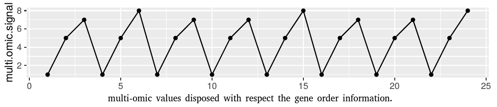

#  Signal metrics analysis of oscillatory patterns in bacterial multi-omic networks
### Multi-omic oscillations in bacteria.

This repository contains the supplementary materials of the manuscript mentioned in the title, the whole data set of the signal metrics (**RData format**) and the associated source code, written in **R**.


Should you need help running our code, please [contact us](mailto:fbardozzo@unisa.it).

### Published paper
Here the whole paper [OxfordBioLink](https://doi.org/10.1093/bioinformatics/btaa966)


### Citation

```
@article{10.1093/bioinformatics/btaa966,
    author = {Bardozzo, Francesco and Lió, Pietro and Tagliaferri, Roberto},
    title = "{Signal metrics analysis of oscillatory patterns in bacterial multi-omic networks}",
    journal = {Bioinformatics},
    year = {2020},
    month = {11},
    issn = {1367-4803},
    doi = {10.1093/bioinformatics/btaa966},
    url = {https://doi.org/10.1093/bioinformatics/btaa966},
    note = {btaa966},
    eprint = {https://academic.oup.com/bioinformatics/advance-article-pdf/doi/10.1093/bioinformatics/btaa966/34297870/btaa966.pdf},
}
```


#### Step 1 - Inter-organisms amplitude consensus (IOAC) procedure 
In order to compare the signals between different organisms, an amplitude discretization process was applied. The number of levels of discretization is decided through the following procedure, that it is called: Inter Organisms Amplitude Consensus (IOAC) [source code here](ioac_procedure/Data_norm.R). The relative dependencies to the RData datasets are explicitly indicated in the source code.

#### Step 2 -  Median change point detector in order to search the periodicity windows ( Algorithm 1) 
The median change point detection algorithm for the estimation of the half periodicity search windows (theta) is calculated as described [here](SupplementaryAlgo1.R). See also the table of the [estimated thetas](table_of_thetas) applied for all the organisms and for all the multi-omic combinations. 

#### Step 3 -  Oscillation indices (Algorithm 2)
The oscillation indices (osc_s and osc_k) for multi-omic signal were calculated with the script linked [here](SupplementaryAlgo2.R). 
1) **osc_s** is an oscillation index which relates the length of the half periods found along the signal with respect to their amplitude. 
2) **osc_k** is an index that describes the cardinality of the half periods along the signal with respect to the signal length.
In order to test the script in this source code we provide two simple toy examples:

Example 1:

```
name.pathway  = "org:KEGGCODE1"
multi.omic.signal =  c(1,5,7,1,5,8,1,5,7,1,5,7,1,5,8,1,5,7,1,5,7,1,5,8)   #discretized and ordered multi-omics
IOAC.bins         =  8
theta             =  3
...
run algorithm2
multi-omic variation: 4 2 6 4 3 7 4 2 6 4 2 6 4 3 7 4 2 6 4 2 6 4 3
change points:        1  1 -1  1  1 -1  1  1 -1  1  1 -1  1  1 -1  1  1 -1  1  1 -1  1  1

multi-omic amount per theta:  6 6 7 7 6 6 6 6 7 7 6 6 6 6 7
half-period window length:    2 1 2 1 2 1 2 1 2 1 2 1 2 1 2
...
output:       osc_s =  0.9068323
              osc_k =  0.6521739 
```

Example 2:

```
name.pathway  = "org:KEGGCODE2"
multi.omic.signal =  c(1,5,7,3,5,8,2,3,5,1,4,6,1,4,3,2,1,2,1,8,1,6,7)   #discretized and ordered multi-omics
IOAC.bins         =  8
theta             =  3
...
run algorithm2
multi-omic variation: 4 2 4 2 3 6 1 2 4 3 2 5 3 1 1 1 1 1 7 7 5 1
change points:        1  1 -1  1  1 -1  1  1 -1  1  1 -1  1 -1 -1 -1  1 -1  1 -1  1  1

multi-omic amount per theta:  6 4 5 6 3 4 5 5 3 3 1 1 7 7 6
half-period window length:    2 1 2 1 2 1 2 1 1 3 1 1 1 1 2
...
output:       osc_s =  0.6298701
              osc_k =  0.6818182 
```


In the next subsecton we link the whole dataset of the multi-omic metric signals associated by experiments, organisms and pathways. 


#### Step 4 -  Whole dataset of the multi-omic signal metrics

Note, in order to make the algorithms described above faster and easier to use, we have provided simple examples. The same algorithms, however, have been applied to more than two million of mult-omic signals and the results obtained are collected in this dataset: [MOSignalMetrics/global.nt](https://thinfi.com/mw9k). The password is: 'MO00@.'
In addition, the dataset already contains all the associations to the functional classes of [KEGG Orthology](https://www.genome.jp/kegg-bin/get_htext?ko00001) and to the identifiers linked to the [COLOMBOS v3.0](http://colombos.net/) condition contrasts\experiments. More in detail, below we describe the fields of the dataset: 
1) "score" : the osc_s index, 
2) "m.s"   : the average value of osc_s
3) "med.s" : the median value of osc_s
4) "sd.s"  : the standard deviation of osc_s
5) "m.w"   : the average value of the period lengths
6) "med.w" : the median value of the period lengths
7) "sd.w"  : the standard deviation of the period lengths
8) "change.w"     : number of periodic oscillations
9) "v.change.w"   : the osc_k index
10) "path.l"      : length of the signal
11) "n.path"      : KEGG pathway ID
12) "exp.cr"      : COLOMBOS v3.0 condition contrast ID
13) "exp.ref"     : COLOMBOS v3.0 treatment experiment ID
14) "exp.ctr"     : COLOMBOS v3.0 control experiment ID
15) "kegg.id"     : KEGG organism ID
16) "code"        : ID of the multi-omic combination
17) "class"       : KEGG orthology level 1
18) "func"        : KEGG orthology level 2
19) "pathway_map" : KEGG orthology level 3

Note, for the field "code", these are the possible IDs:
1)  "n1" = CAI + Molecular Weight
2)  "n2" = CAI + mRNA CCs 
3)  "n3" = Molecular Weigth  + mRNA CCs 
4)  "n4" = CAI + Molecular Weigth  + mRNA CCs

While, for the operon compressed signals:
1)  "o1" = CAI + Molecular Weight
2)  "o2" = CAI + mRNA CCs 
3)  "o3" = Molecular Weigth  + mRNA CCs
4)  "o4" = CAI + Molecular Weigth  + mRNA CCs

#### Step 5 -  Phase synchronizations and plots
Once the dataset described above has been downloaded, it will be possible to analyze the [phase synchronizations](phase_synchronization/). To do this, in this section we provide [two scripts](phase_synchronization/). Through these scripts it is possible to interact with the signal metrics dataset and conduct your own analyses in order to identify the oscillatory networks, for example by considering a restricted subset of organisms or only specific COLOMBOS v3.0 experiments.
However, in order to speed up the visualization of the plotted figures, all the intersections of the oscillatory networks with phi = 0.8 have been generated in pdf files. The analysis was done [between bacteria](phase_synchronization/between_org_upsets/) and [within bacteria](phase_synchronization/whitin_org_upsets/). In the respective section you can find the description of the files name structure. The relative dependencies to the RData datasets are explicitly indicated in the source code.

###Licence
The source, the material, the figures are under the same licence of Oxford Bioinformatics Journal
